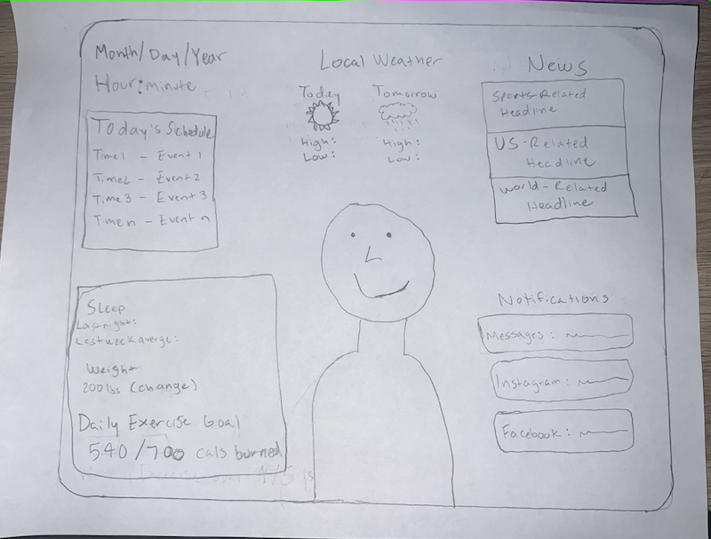

# p2.aidan.mullins
Link to github repository: https://github.com/aidanmullins/p2.aidan.mullins

# Part C
In the sketch below you will see my design for a magic mirror that includes personalized informations such as the date, time, local weather, personal schedule for the day, health information, news, as well as personal notifications such as texts or Snapchats.

When considering the layout of the features on my magic mirror, I focused on the idea that myself, as well as other American users would be trained to read information from left to right. I strategically placed the date and time in the top left, with my personal schedule directly below it, as I felt this was the most important information and what I should see first when looking at the mirror.

The weather in the top-middle of the mirror is most visually appealing directly above your head with the news adjacent to the weather in the top right only making sense. The weather includes the information about today's weather as well as tomorrow's weather so that you can plan ahead for the next day if you choose to do so. The news feed will always include one sports-related headline, which I have placed at the top because it is most likely to catch my attention and lead me to read the rest of the headlines. It also includes one U.S.-related headline, and one world-related headline.

With only the health information and personal notifications left, it's somewhat of a toss-up as to whether to place each of those on the bottom-left or bottom-right. I found that the health info on the left and personal notifications on the right looked the best.

The health information includes a section about sleep which shows how much you slept last night, as well as comparing that to the average amount of sleep you have received over the course of the past week. It also includes your current weight, and shows the change in your weight compared to a week before. Finally the health section includes a daily exercise goal with a desired number of calories to burn and how far along you are to reaching that goal.

# Part B

